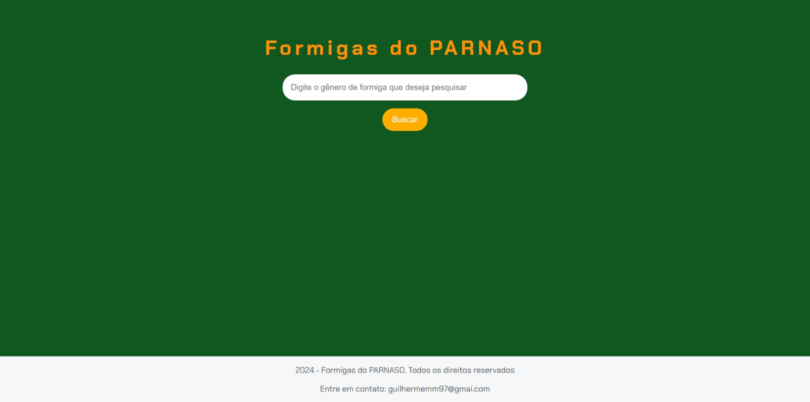

## Formiguinhas Programando: Um Guia Básico para Explorar o Mundo das Formigas do PARNASO

### O que é esse bicho?

Já se perguntou como as formigas organizam suas colônias e quais são suas aventuras pelo PARNASO? Essa aplicação web é sua porta de entrada para um mundo fascinante de entomologia! 

### Como funciona?

1. **Digite e Descubra:** Digite o gênero da formiga que te interessa na barra de pesquisa, como por exemplor: SOLENOPSIS, LABIDUS ou PHEIDOLE.
2. **Resultados Instantâneos:** A mágica acontece! A aplicação vasculha nossa base de dados e te apresenta todas as formigas que combinam com sua busca.
3. **Explore à Vontade:** Cada resultado te leva a um perfil completo da formiga, com informações sobre suas altitudes, abundância e até uma foto para você dar uma olhadinha mais de perto.

### Por que você vai amar?

* **Fácil de usar:** Interface simples e intuitiva para que você possa se concentrar no que realmente importa: as formigas!
* **Cheio de informações:** Descubra curiosidades sobre as diferentes espécies e seus habitats.
* **Visualmente atraente:** As imagens das formigas vão te encantar!
* **Código aberto:** Quer saber como tudo funciona por trás das cortinas? O código está disponível para você explorar e aprender.

### Para os curiosos:

* **HTML:** A estrutura da página, como um esqueleto que dá forma ao nosso formigueiro digital.
* **CSS:** A maquiagem que deixa tudo bonito e organizado.
* **JavaScript:** A inteligência por trás da aplicação, responsável por buscar e exibir as informações.

### Contribua com a colônia!

Quer ajudar a expandir nosso formigueiro? Envie um pull request com novas informações sobre as formigas do PARNASO ou sugestões de melhorias para o código. 

**Vamos juntos desvendar os segredos do mundo das formigas!** 

**#formigas #programação #PARNASO #openSource #entomologia**
